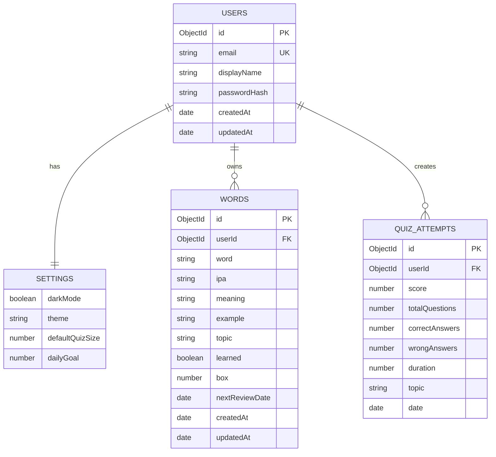

# Thiết Kế Cơ Sở Dữ Liệu LingoFlow (MongoDB, Express, React)

Tài liệu này đề xuất phương án thiết kế Cơ sở dữ liệu (Database Schema) cho ứng dụng **LingoFlow** để chuyển đổi từ mô hình lưu trữ cục bộ (`LocalStorage`) sang mô hình cơ sở dữ liệu tập trung sử dụng **MongoDB** (thông qua **Mongoose ODM**), kết hợp với RESTful API xây dựng bằng **Express.js**.

---

## 1. Kiến Trúc Dữ Liệu Tổng Quan

Ứng dụng LingoFlow quản lý 4 thực thể chính:
1.  **Người dùng (User)**: Thông tin tài khoản đăng nhập.
2.  **Từ vựng (Word)**: Danh sách từ vựng cá nhân hóa theo từng người học.
3.  **Lịch sử kiểm tra (QuizAttempt)**: Kết quả các bài test mini quiz của người dùng.
4.  **Cấu hình ứng dụng (AppSettings)**: Cài đặt theme, chế độ tối, mục tiêu hàng ngày của người dùng.

### Sơ đồ mối quan hệ thực thể (ERD)



---

## 2. Chi Tiết Thiết Kế Schema (Mongoose Models)

Nhằm tối ưu hóa tốc độ truy vấn của MongoDB, chúng ta sẽ áp dụng các quy chuẩn thiết kế:
*   **Embedded Document (Tài liệu nhúng)**: Nhúng `Settings` trực tiếp vào tài liệu `User` do đây là mối quan hệ 1-1, kích thước nhỏ và luôn được tải kèm khi người dùng đăng nhập.
*   **Reference Document (Tài liệu tham chiếu)**: Tách `Words` và `QuizAttempts` thành các collection riêng lẻ và tham chiếu tới `userId`. Điều này tránh giới hạn dung lượng tài liệu 16MB của MongoDB khi số lượng từ vựng hoặc lượt chơi quiz của người dùng tăng lên hàng ngàn bản ghi.

### 2.1 Collection: `users` (Quản lý Người Dùng & Cấu Hình)

```typescript
import { Schema, model, Document } from 'mongoose';

// Interface cho Settings (Nhúng)
interface ISettings {
  darkMode: boolean;
  theme: 'normal' | 'light' | 'dark';
  defaultQuizSize: number;
  dailyGoal: number;
}

// Interface cho User Document
export interface IUser extends Document {
  email: string;
  displayName: string;
  passwordHash: string;
  settings: ISettings;
  createdAt: Date;
  updatedAt: Date;
}

const SettingsSchema = new Schema<ISettings>({
  darkMode: { type: Boolean, default: false },
  theme: { type: String, enum: ['normal', 'light', 'dark'], default: 'normal' },
  defaultQuizSize: { type: Number, default: 10 },
  dailyGoal: { type: Number, default: 5 }
}, { _id: false });

const UserSchema = new Schema<IUser>({
  email: { 
    type: String, 
    required: true, 
    unique: true, 
    trim: true, 
    lowercase: true,
    match: [/^\S+@\S+\.\S+$/, 'Email không hợp lệ']
  },
  displayName: { type: String, required: true, trim: true },
  passwordHash: { type: String, required: true },
  settings: { type: SettingsSchema, default: () => ({}) }
}, {
  timestamps: true // Tự động tạo createdAt và updatedAt
});

// Index
UserSchema.index({ email: 1 });

export const UserModel = model<IUser>('User', UserSchema);
```

### 2.2 Collection: `words` (Quản lý Từ Vựng)

```typescript
import { Schema, model, Document, Types } from 'mongoose';

export interface IWord extends Document {
  userId: Types.ObjectId;
  word: string;
  ipa: string;
  meaning: string;
  example: string;
  topic: string;
  learned: boolean;
  box: number;
  nextReviewDate: Date;
  createdAt: Date;
  updatedAt: Date;
}

const WordSchema = new Schema<IWord>({
  userId: { type: Schema.Types.ObjectId, ref: 'User', required: true },
  word: { type: String, required: true, trim: true },
  ipa: { type: String, trim: true, default: '' },
  meaning: { type: String, required: true, trim: true },
  example: { type: String, trim: true, default: '' },
  topic: { type: String, required: true, trim: true, default: 'Chung' },
  learned: { type: Boolean, default: false },
  box: { type: Number, min: 1, max: 5, default: 1 },
  nextReviewDate: { type: Date, default: Date.now }
}, {
  timestamps: true
});

// Indexes cho tối ưu hóa hiệu suất truy vấn
// 1. Chỉ mục kép phục vụ việc tìm kiếm từ vựng theo người dùng và từ/nghĩa
WordSchema.index({ userId: 1, word: 1 });
// 2. Chỉ mục phục vụ thuật toán Spaced Repetition (Lọc các từ cần ôn tập)
WordSchema.index({ userId: 1, nextReviewDate: 1 });
// 3. Chỉ mục lọc theo Topic và Trạng thái học
WordSchema.index({ userId: 1, topic: 1, learned: 1 });

export const WordModel = model<IWord>('Word', WordSchema);
```

### 2.3 Collection: `quizattempts` (Lịch Sử Mini Quiz)

```typescript
import { Schema, model, Document, Types } from 'mongoose';

export interface IQuizAttempt extends Document {
  userId: Types.ObjectId;
  score: number;
  totalQuestions: number;
  correctAnswers: number;
  wrongAnswers: number;
  duration: number; // Tính bằng giây
  topic: string;
  date: Date;
}

const QuizAttemptSchema = new Schema<IQuizAttempt>({
  userId: { type: Schema.Types.ObjectId, ref: 'User', required: true },
  score: { type: Number, required: true, min: 0, max: 100 },
  totalQuestions: { type: Number, required: true, min: 1 },
  correctAnswers: { type: Number, required: true, min: 0 },
  wrongAnswers: { type: Number, required: true, min: 0 },
  duration: { type: Number, required: true }, // Giây
  topic: { type: String, required: true, default: 'Hỗn hợp' },
  date: { type: Date, default: Date.now }
});

// Indexes
// Truy vấn lịch sử làm quiz theo người dùng, sắp xếp theo thời gian mới nhất
QuizAttemptSchema.index({ userId: 1, date: -1 });

export const QuizAttemptModel = model<IQuizAttempt>('QuizAttempt', QuizAttemptSchema);
```

---

## 3. Thiết Kế Các Điểm Cuối RESTful API (Express.js Router)

Để phục vụ giao diện React kết nối đến Database mới, Express cần xây dựng các route API chính như sau:

| Module | HTTP Method | Endpoint | Mô Tả |
| :--- | :--- | :--- | :--- |
| **Auth** | `POST` | `/api/auth/register` | Đăng ký tài khoản mới & Khởi tạo dữ liệu mẫu |
| | `POST` | `/api/auth/login` | Đăng nhập tài khoản & Trả về JSON Web Token (JWT) |
| | `GET` | `/api/auth/me` | Lấy thông tin tài khoản hiện tại từ Token |
| **Settings** | `PUT` | `/api/users/settings` | Cập nhật cấu hình ứng dụng (theme, font, daily goal) |
| **Vocabulary**| `GET` | `/api/words` | Lấy danh sách từ vựng (Hỗ trợ query: `search`, `topic`, `learned`, `sort`) |
| | `POST` | `/api/words` | Tạo mới một từ vựng |
| | `PUT` | `/api/words/:id` | Cập nhật thông tin chi tiết từ vựng |
| | `PATCH` | `/api/words/:id/learned` | Đánh dấu thuộc/chưa thuộc (Tính toán lại Leitner Box & Next Review Date) |
| | `DELETE`| `/api/words/:id` | Xóa một từ vựng |
| **Quiz** | `POST` | `/api/quiz/attempts`| Lưu kết quả một lượt làm Mini Quiz |
| | `GET` | `/api/quiz/attempts`| Lấy lịch sử tất cả các lượt làm Quiz của User |
| **Data Sync** | `POST` | `/api/data/import` | Nhập tệp JSON để hợp nhất/ghi đè dữ liệu cục bộ lên Cloud |
| | `GET` | `/api/data/export` | Xuất toàn bộ dữ liệu của User dưới dạng JSON |

---

## 4. Bảo Mật & Xác Thực (Authentication & Security)

1.  **JSON Web Token (JWT)**:
    *   Mọi yêu cầu chỉnh sửa/truy xuất từ vựng, cài đặt, hoặc quiz của người dùng cần đi kèm Header `Authorization: Bearer <token>`.
    *   Express Middleware sẽ giải mã JWT để trích xuất `userId` và gán vào request (`req.user.id`).
2.  **Mã hóa mật khẩu**:
    *   Sử dụng thư viện `bcryptjs` để hash mật khẩu với `saltRounds = 10` trước khi lưu vào MongoDB, thay vì dùng phương pháp mã hóa Base64 đơn giản ở LocalStorage.
3.  **Ràng buộc dữ liệu ở API**:
    *   Khi thực hiện thao tác Thêm/Sửa/Xóa từ vựng hay xem lượt Quiz, API Backend cần kiểm tra quyền sở hữu: `userId` trong bản ghi từ vựng phải trùng khớp với `userId` giải mã từ JWT token.

---

## 5. Kế Hoạch Di Cư Dữ Liệu (Migration Plan)

Để không làm mất dữ liệu học tập hiện tại của người dùng khi nâng cấp từ LocalStorage lên MongoDB:

1.  **Bước 1: Export từ Client**
    *   Người dùng đăng nhập phiên bản cũ (sử dụng LocalStorage) xuất file backup qua tính năng "Export Data" của tab Settings để có tệp dữ liệu JSON.
2.  **Bước 2: Upload lên Server**
    *   Tại phiên bản mới, sau khi đăng ký tài khoản thành công trên MongoDB, hệ thống sẽ nhắc người dùng nhập dữ liệu cũ bằng cách gửi file JSON qua API `/api/data/import`.
3.  **Bước 3: Xử lý và Hợp nhất**
    *   Backend sẽ duyệt qua mảng `words`, gán trường `userId = req.user.id`, tạo `_id` mới cho mỗi từ vựng và lưu vào MongoDB bằng lệnh `insertMany`.
    *   Thao tác tương tự đối với lịch sử `attempts`.
