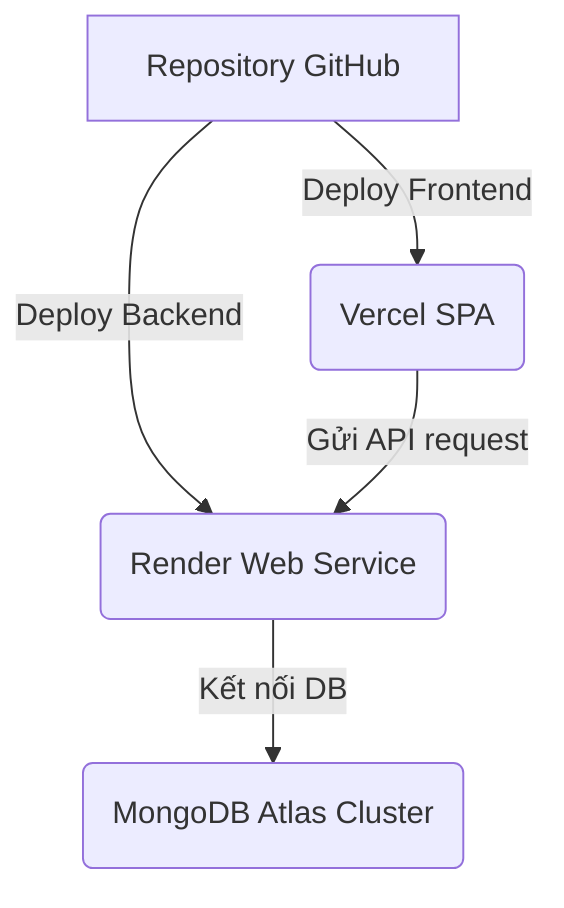

# Kế hoạch & Hướng dẫn triển khai dự án LingoFlow (MERN Stack)

Tài liệu này hướng dẫn chi tiết cách triển khai toàn bộ ứng dụng LingoFlow lên môi trường production thực tế, bao gồm:
*   **Database**: MongoDB Atlas (Free Tier)
*   **Backend**: Render (Web Service - Free Tier)
*   **Frontend**: Vercel (Hỗ trợ Single Page Application)

---

## 🗺️ Quy trình tổng quan

---

## 1. Chuẩn bị cơ sở dữ liệu (MongoDB Atlas)

Trước khi cấu hình Server, bạn cần có một cơ sở dữ liệu MongoDB chạy trên đám mây.

1. **Tạo tài khoản & Cluster**:
   * Truy cập [MongoDB Atlas](https://www.mongodb.com/cloud/atlas) và đăng ký tài khoản miễn phí.
   * Tạo một Cluster mới sử dụng gói **M0 Free** (chọn khu vực gần Việt Nam như Singapore hoặc AWS ap-southeast-1 để tối ưu tốc độ).

2. **Cấu hình Quyền truy cập (Database Access)**:
   * Vào mục **Database Access** -> **Add New Database User**.
   * Thiết lập **Username** và **Password** (Hãy lưu lại thông tin này để cấu hình biến môi trường).
   * Gán quyền `Read and write to any database` cho user này.

3. **Cấu hình Mạng (Network Access)**:
   * Vào mục **Network Access** -> **Add IP Address**.
   * Nhấp chọn **Allow Access From Anywhere** (`0.0.0.0/0`) để cho phép Render kết nối vào cơ sở dữ liệu.
   > [!WARNING]  
   > Render sử dụng các IP động cho gói Free, do đó bắt buộc phải cấu hình `0.0.0.0/0` để tránh bị chặn kết nối.

4. **Lấy chuỗi kết nối (Connection String)**:
   * Vào mục **Database** -> Nhấp **Connect** ở Cluster vừa tạo -> Chọn **Drivers** (Node.js).
   * Sao chép đường dẫn kết nối có dạng:
     `mongodb+srv://<username>:<password>@cluster0.xxxx.mongodb.net/?retryWrites=true&w=majority&appName=Cluster0`
   * Thay thế `<username>` và `<password>` bằng thông tin tài khoản Database Access vừa tạo.

---

## 2. Triển khai Backend (Render)

Render là dịch vụ lý tưởng để chạy Express server NodeJS miễn phí.

### Cấu hình Web Service:
1. Đăng nhập vào [Render](https://render.com/) bằng tài khoản GitHub của bạn.
2. Nhấp **New** -> **Web Service** -> Chọn Repository GitHub của dự án LingoFlow.
3. Cấu hình các thông tin cơ bản:
   * **Name**: `lingoflow-backend` (hoặc tên tùy ý).
   * **Region**: Trùng vùng với MongoDB Atlas (Ví dụ: `Singapore (Southeast Asia)`).
   * **Branch**: `main` (hoặc nhánh chứa code backend mới nhất).
   * **Root Directory**: `backend` (Cực kỳ quan trọng để Render định vị đúng code Node.js).
   * **Runtime**: `Node`.
   * **Build Command**: `npm install && npm run build`
   * **Start Command**: `node dist/index.js`

### Thiết lập biến môi trường (Environment Variables):
Trong mục **Advanced** -> **Add Environment Variable**, thêm các khóa sau:

| Tên biến (Key) | Giá trị (Value) | Mô tả |
| :--- | :--- | :--- |
| `NODE_ENV` | `production` | Chế độ chạy ứng dụng |
| `PORT` | `10000` | Render tự động gán port này, hoặc để hệ thống tự cấu hình |
| `MONGODB_URI` | *[Chuỗi kết nối MongoDB Atlas đã thay pass]* | Đường dẫn đến database cloud |
| `JWT_SECRET` | *[Chuỗi ký tự bảo mật tự sinh]* | Khóa bí mật dùng để ký và giải mã mã token JWT |
| `FRONTEND_URL` | *[Đường dẫn trang Vercel sau khi deploy]* | URL Frontend nhằm thiết lập CORS an toàn |

> [!NOTE]  
> Do gói Free của Render sẽ tự động ngủ (spin down) sau 15 phút không có hoạt động, lượt gọi API đầu tiên sau khoảng thời gian này có thể mất từ 50-60 giây để server khởi động lại.

---

## 3. Triển khai Frontend (Vercel)

Vercel là nền tảng tốt nhất cho các dự án React Vite.

### Cấu hình Project trên Vercel:
1. Đăng nhập vào [Vercel](https://vercel.com/) thông qua tài khoản GitHub.
2. Nhấp **Add New** -> **Project** -> Chọn Repository chứa dự án.
3. Thiết lập thông số Build:
   * **Framework Preset**: `Vite` (Vercel sẽ tự động phát hiện).
   * **Root Directory**: `frontend` (Bắt buộc chọn thư mục này).
   * **Build Command**: `npm run build`
   * **Output Directory**: `dist`
   * **Install Command**: `npm install`

### Thiết lập biến môi trường (Environment Variables):
Mở rộng mục **Environment Variables** và thêm biến liên kết với Backend:

| Tên biến (Key) | Giá trị (Value) | Mô tả |
| :--- | :--- | :--- |
| `VITE_API_URL` | `https://lingoflow-backend.onrender.com/api` | Đường dẫn đến URL backend đã deploy trên Render (phải kết thúc bằng `/api`) |

4. Nhấn **Deploy** và chờ Vercel biên dịch code.

---

## 🛠️ Một số vấn đề thường gặp (Troubleshooting)

### 1. Lỗi CORS (Cross-Origin Resource Sharing)
* **Triệu chứng**: Frontend không gọi được API, console log báo lỗi CORS.
* **Cách sửa**: 
  - Đảm bảo `FRONTEND_URL` trong mục biến môi trường của Render trùng khớp hoàn toàn với địa chỉ trang Vercel (ví dụ: `https://lingoflow-xxxx.vercel.app` - không có dấu gạch chéo `/` ở cuối).
  - Khởi động lại (Redeploy) Backend trên Render sau khi sửa đổi.

### 2. Lỗi Trang trắng khi reload ở URL con (ví dụ: `/vocabulary` hoặc `/quiz`)
* **Triệu chứng**: Khi bấm F5 tải lại các trang khác Dashboard, Vercel trả về lỗi 404.
* **Cách sửa**: 
  - File cấu hình [vercel.json](file:///e:/User/Work_Space/Netspace/English_App_Netspace/frontend/vercel.json) đã được tạo sẵn trong thư mục `frontend` để tự động điều hướng tất cả URL về `index.html` (SPA Routing). Đảm bảo tệp này đã được đẩy lên GitHub thành công.

### 3. Server không thể kết nối tới Database
* **Triệu chứng**: Log của Render hiển thị lỗi `MongooseServerSelectionError`.
* **Cách sửa**: 
  - Truy cập MongoDB Atlas và kiểm tra lại Network Access đã kích hoạt IP `0.0.0.0/0` chưa.
  - Kiểm tra xem mật khẩu cơ sở dữ liệu điền trong chuỗi `MONGODB_URI` đã chuẩn xác chưa (Lưu ý tránh dùng các ký tự đặc biệt như `@`, `:`, `/` trong mật khẩu vì có thể làm lỗi cú pháp URI kết nối).
