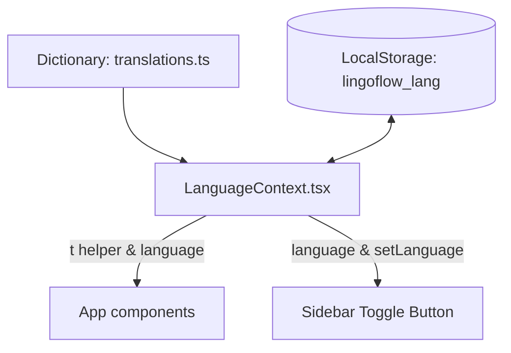

# Đặc tả Kỹ thuật: Tính năng Chuyển đổi Ngôn ngữ hiển thị (i18n)

Tính năng này cho phép người dùng chuyển đổi ngôn ngữ hiển thị toàn bộ giao diện của ứng dụng LingoFlow giữa hai ngôn ngữ: **Tiếng Việt** (mặc định) và **Tiếng Anh** thông qua một nút chuyển đổi đơn duy nhất nằm trên Sidebar.

---

## 1. Kiến trúc Hệ thống

Chúng ta sẽ xây dựng hệ thống đa ngôn ngữ nội bộ (lightweight i18n) mà không cài đặt thêm các thư viện cồng kềnh như `react-i18next`. Kiến trúc bao gồm 3 phần:



1.  **Từ điển dịch (`translations.ts`)**: Nơi lưu các cặp khóa - giá trị của các chuỗi văn bản cho Tiếng Việt (`vi`) và Tiếng Anh (`en`).
2.  **Bộ quản lý trạng thái (`LanguageContext.tsx`)**: React Context quản lý ngôn ngữ hiện tại, lưu vào LocalStorage và cung cấp hàm tiện ích dịch `t()`.
3.  **Thành phần hiển thị (UI Components)**: Các trang (`Dashboard`, `Vocabulary`, `Flashcards`, `Quiz`, `Stats`, `Settings`, `LoginPage`, `RegisterPage`) và Layout (`Sidebar`, `TopBar`) sử dụng hook `useLanguage` để lấy chuỗi dịch và cập nhật giao diện.

---

## 2. Chi tiết Thành phần

### A. Từ điển Ngôn ngữ (`src/utils/translations.ts`)

Các khóa dịch sẽ được gom nhóm theo trang để dễ dàng quản lý.

```typescript
export type Language = 'vi' | 'en';

export const translations = {
  vi: {
    sidebar: {
      dashboard: 'Bảng điều khiển',
      vocabulary: 'Từ vựng',
      flashcards: 'Thẻ ghi nhớ',
      quiz: 'Kiểm tra',
      stats: 'Thống kê',
      settings: 'Cài đặt',
    },
    topbar: {
      learned: 'đã học',
      logout: 'Đăng xuất',
      searchPlaceholder: 'Tìm kiếm từ vựng...',
      guest: 'Người dùng',
      notLoggedIn: 'Chưa đăng nhập',
    },
    auth: {
      login: 'Đăng nhập',
      register: 'Đăng ký',
      email: 'Email',
      password: 'Mật khẩu',
      confirmPassword: 'Xác nhận mật khẩu',
      displayName: 'Tên hiển thị',
      loginSub: 'Chào mừng trở lại! Vui lòng nhập thông tin để tiếp tục.',
      registerSub: 'Tạo tài khoản mới để lưu dữ liệu học tập riêng tư.',
      hasAccount: 'Đã có tài khoản?',
      noAccount: 'Chưa có tài khoản?',
      loginNow: 'Đăng nhập ngay',
      registerNow: 'Đăng ký ngay',
      passwordMismatch: 'Mật khẩu và xác nhận mật khẩu không khớp.',
    },
    dashboard: {
      welcome: 'Chào mừng trở lại,',
      streakInfo: 'Duy trì học tập để đạt kết quả tốt nhất!',
      vocabularySummary: 'Thống kê từ vựng',
      totalWords: 'Tổng số từ',
      learnedWords: 'Đã thuộc lòng',
      unlearnedWords: 'Từ mới/Đang học',
      quizAttempts: 'Số lượt kiểm tra',
      averageScore: 'Điểm trung bình',
      studyNow: 'Học ngay bây giờ',
      recentWords: 'Từ vựng học gần đây',
      noRecentWords: 'Chưa có từ vựng nào được thêm gần đây.',
    },
    vocabulary: {
      title: 'Quản lý từ vựng',
      addNew: 'Thêm từ mới',
      wordLabel: 'Từ vựng (tiếng Anh)',
      ipaLabel: 'Phiên âm (IPA)',
      meaningLabel: 'Nghĩa (tiếng Việt)',
      exampleLabel: 'Ví dụ minh họa',
      topicLabel: 'Chủ đề',
      search: 'Tìm kiếm từ vựng...',
      all: 'Tất cả',
      learned: 'Đã thuộc',
      notLearned: 'Đang học',
      actions: 'Hành động',
      emptyWords: 'Không tìm thấy từ vựng nào. Hãy thêm từ vựng mới để bắt đầu học!',
      deleteConfirm: 'Bạn có chắc chắn muốn xóa từ này?',
      save: 'Lưu',
      cancel: 'Hủy',
    },
    flashcards: {
      title: 'Thẻ ghi nhớ (Flashcard)',
      selectTopic: 'Chọn chủ đề ôn tập:',
      allTopics: 'Tất cả chủ đề',
      noCards: 'Không có thẻ nào cần ôn tập hôm nay. Hãy học thêm từ mới!',
      pressSpace: 'Nhấn phím Cách hoặc nhấp vào thẻ để lật',
      correct: 'Đã nhớ',
      incorrect: 'Chưa nhớ',
      remaining: 'Còn lại',
      box: 'Hộp Leitner',
      nextReview: 'Ôn tập tiếp theo',
    },
    quiz: {
      title: 'Trắc nghiệm từ vựng',
      config: 'Cài đặt bài trắc nghiệm',
      questionCount: 'Số lượng câu hỏi:',
      selectTopic: 'Chọn chủ đề câu hỏi:',
      start: 'Bắt đầu kiểm tra',
      score: 'Điểm số của bạn',
      correct: 'Đúng',
      incorrect: 'Sai',
      completed: 'Bài kiểm tra hoàn thành!',
      tryAgain: 'Làm lại',
      backToDashboard: 'Quay lại Bảng điều khiển',
    },
    settings: {
      title: 'Cài đặt hệ thống',
      themeTitle: 'Bảng màu & Giao diện',
      themeLight: 'Giao diện Sáng',
      themeDark: 'Giao diện Tối',
      themeNormal: 'Giao diện Tiêu chuẩn (Ấm áp)',
      quizSize: 'Số câu hỏi trắc nghiệm mặc định:',
      dailyGoal: 'Mục tiêu số từ học mỗi ngày:',
      dataTitle: 'Sao lưu & Đồng bộ',
      export: 'Xuất dữ liệu',
      import: 'Nhập dữ liệu',
      reset: 'Xóa toàn bộ dữ liệu',
      resetConfirm: 'HÀNH ĐỘNG NÀY KHÔNG THỂ KHÔI PHỤC! Bạn có chắc chắn muốn xóa toàn bộ từ vựng và lịch sử?',
    }
  },
  en: {
    sidebar: {
      dashboard: 'Dashboard',
      vocabulary: 'Vocabulary',
      flashcards: 'Flashcards',
      quiz: 'Quiz',
      stats: 'Statistics',
      settings: 'Settings',
    },
    topbar: {
      learned: 'learned',
      logout: 'Log Out',
      searchPlaceholder: 'Search vocabulary...',
      guest: 'Guest User',
      notLoggedIn: 'Not Logged In',
    },
    auth: {
      login: 'Log In',
      register: 'Register',
      email: 'Email',
      password: 'Password',
      confirmPassword: 'Confirm Password',
      displayName: 'Display Name',
      loginSub: 'Welcome back! Please fill in details to continue.',
      registerSub: 'Create a new account to sync study data privately.',
      hasAccount: 'Already have an account?',
      noAccount: 'Don\'t have an account?',
      loginNow: 'Log In Now',
      registerNow: 'Register Now',
      passwordMismatch: 'Passwords do not match.',
    },
    dashboard: {
      welcome: 'Welcome back,',
      streakInfo: 'Keep studying to hit your goals!',
      vocabularySummary: 'Vocabulary Statistics',
      totalWords: 'Total Words',
      learnedWords: 'Learned Words',
      unlearnedWords: 'New/Learning Words',
      quizAttempts: 'Quiz Attempts',
      averageScore: 'Average Score',
      studyNow: 'Study Now',
      recentWords: 'Recently Added Words',
      noRecentWords: 'No words added recently.',
    },
    vocabulary: {
      title: 'Vocabulary Manager',
      addNew: 'Add New Word',
      wordLabel: 'Vocabulary (English)',
      ipaLabel: 'Phonetic (IPA)',
      meaningLabel: 'Meaning (Vietnamese)',
      exampleLabel: 'Example Sentence',
      topicLabel: 'Topic',
      search: 'Search vocabulary...',
      all: 'All',
      learned: 'Learned',
      notLearned: 'Learning',
      actions: 'Actions',
      emptyWords: 'No words found. Add new words to start learning!',
      deleteConfirm: 'Are you sure you want to delete this word?',
      save: 'Save',
      cancel: 'Cancel',
    },
    flashcards: {
      title: 'Flashcards Review',
      selectTopic: 'Select Topic to Review:',
      allTopics: 'All Topics',
      noCards: 'No cards to review today. Add more words!',
      pressSpace: 'Press Spacebar or click the card to flip',
      correct: 'I Know It',
      incorrect: 'Forgot It',
      remaining: 'Remaining',
      box: 'Leitner Box',
      nextReview: 'Next Review',
    },
    quiz: {
      title: 'Vocabulary Quiz',
      config: 'Configure Quiz Settings',
      questionCount: 'Number of Questions:',
      selectTopic: 'Select Quiz Topic:',
      start: 'Start Quiz',
      score: 'Your Score',
      correct: 'Correct',
      incorrect: 'Incorrect',
      completed: 'Quiz Completed!',
      tryAgain: 'Try Again',
      backToDashboard: 'Back to Dashboard',
    },
    settings: {
      title: 'System Settings',
      themeTitle: 'Theme & Aesthetics',
      themeLight: 'Light Mode',
      themeDark: 'Dark Mode',
      themeNormal: 'Normal Mode (Warm)',
      quizSize: 'Default Quiz Size:',
      dailyGoal: 'Daily Learning Goal (Words):',
      dataTitle: 'Backup & Sync',
      export: 'Export Data',
      import: 'Import Data',
      reset: 'Reset All Data',
      resetConfirm: 'THIS ACTION CANNOT BE UNDONE! Are you sure you want to delete all vocabulary and attempts?',
    }
  }
};
```

### B. Bộ Quản lý Context (`src/context/LanguageContext.tsx`)

Chúng ta sẽ tạo một Context để chia sẻ trạng thái ngôn ngữ trên toàn bộ ứng dụng. Cấu trúc hàm `t()` sẽ hỗ trợ phân giải các khoá dạng dot-notation (ví dụ: `'auth.login'`).

```typescript
import React, { createContext, useContext, useState, useEffect } from 'react';
import { translations, Language } from '../utils/translations';

interface LanguageContextType {
  language: Language;
  toggleLanguage: () => void;
  t: (keyPath: string) => string;
}

const LanguageContext = createContext<LanguageContextType | undefined>(undefined);

export const LanguageProvider: React.FC<{ children: React.ReactNode }> = ({ children }) => {
  const [language, setLanguage] = useState<Language>(() => {
    return (localStorage.getItem('lingoflow_lang') as Language) || 'vi';
  });

  const toggleLanguage = () => {
    const nextLang: Language = language === 'vi' ? 'en' : 'vi';
    setLanguage(nextLang);
    localStorage.setItem('lingoflow_lang', nextLang);
  };

  // Hàm t hỗ trợ giải quyết khóa lồng nhau, ví dụ: 'sidebar.dashboard'
  const t = (keyPath: string): string => {
    const keys = keyPath.split('.');
    let result: any = translations[language];
    
    for (const key of keys) {
      if (result && result[key] !== undefined) {
        result = result[key];
      } else {
        console.warn(`Translation key not found: ${keyPath} for language: ${language}`);
        return keyPath; // Trả về chính khóa nếu không tìm thấy bản dịch
      }
    }
    
    return typeof result === 'string' ? result : keyPath;
  };

  return (
    <LanguageContext.Provider value={{ language, toggleLanguage, t }}>
      {children}
    </LanguageContext.Provider>
  );
};

export const useLanguage = () => {
  const context = useContext(LanguageContext);
  if (!context) {
    throw new Error('useLanguage must be used within a LanguageProvider');
  }
  return context;
};
```

### C. Nút chuyển đổi đơn trong Sidebar (`src/components/Sidebar.tsx`)

Nút chuyển đổi sẽ được đặt ở vị trí hợp lý ở sidebar (phía trên phần User Card). 

*   **Logic hiển thị**:
    *   Nếu đang ở giao diện Tiếng Việt (`language === 'vi'`), nút hiển thị cờ nước Mỹ/Anh cùng dòng chữ **"English"**. Click sẽ gọi `toggleLanguage()`.
    *   Nếu đang ở giao diện Tiếng Anh (`language === 'en'`), nút hiển thị cờ Việt Nam cùng dòng chữ **"Tiếng Việt"**. Click sẽ gọi `toggleLanguage()`.
*   **Aesthetics**: Giao diện nút cực kỳ cao cấp, sử dụng hiệu ứng hover tinh tế, icon cờ tròn nhỏ và hiệu ứng chuyển màu nền đồng bộ theo theme.

```tsx
{/* Nút Chuyển Đổi Ngôn Ngữ Đơn */}
<button
  onClick={toggleLanguage}
  className="w-full flex items-center justify-between px-6 py-3 rounded-xl text-sm font-semibold border border-slate-200/50 dark:border-slate-800 bg-slate-100/50 dark:bg-slate-900/50 hover:bg-slate-200/60 dark:hover:bg-slate-800/80 transition-all duration-300 group cursor-pointer"
>
  <div className="flex items-center gap-4">
    {language === 'vi' ? (
      <>
        {/* US Flag Icon */}
        <span className="text-lg leading-none" role="img" aria-label="English">🇺🇸</span>
        <span className="text-slate-700 dark:text-slate-300 group-hover:text-indigo-600 dark:group-hover:text-indigo-400 transition-colors">
          English
        </span>
      </>
    ) : (
      <>
        {/* Vietnam Flag Icon */}
        <span className="text-lg leading-none" role="img" aria-label="Tiếng Việt">🇻🇳</span>
        <span className="text-slate-700 dark:text-slate-300 group-hover:text-indigo-600 dark:group-hover:text-indigo-400 transition-colors">
          Tiếng Việt
        </span>
      </>
    )}
  </div>
  <span className="text-[10px] font-bold text-slate-400 dark:text-slate-500 uppercase tracking-wider px-1.5 py-0.5 rounded bg-slate-200/60 dark:bg-slate-800">
    {language === 'vi' ? 'EN' : 'VI'}
  </span>
</button>
```

---

## 3. Kế hoạch Tích hợp

1.  **Bước 1**: Tạo tệp bản dịch `src/utils/translations.ts`.
2.  **Bước 2**: Tạo `src/context/LanguageContext.tsx`.
3.  **Bước 3**: Bao bọc `LanguageProvider` ở gốc ứng dụng (`src/main.tsx`).
4.  **Bước 4**: Tích hợp nút chuyển đổi vào `src/components/Sidebar.tsx` và `src/components/MobileNav.tsx` (phiên bản mobile).
5.  **Bước 5**: Lần lượt cập nhật các chuỗi chữ tĩnh trong các Component để dùng hàm `t()` của `useLanguage`.
    *   *Ví dụ*: thay vì viết `<span>Cài đặt</span>`, ta viết `<span>{t('sidebar.settings')}</span>`.

---

## 4. Tự Đánh giá (Spec Self-Review)

*   **Không dùng placeholder**: Từ điển chứa đầy đủ bản dịch của các mục chính của ứng dụng.
*   **Tính nhất quán**: Hành vi của nút chuyển đổi đơn hoạt động đối xứng (`vi` -> hiển thị nút đổi thành `en`, `en` -> hiển thị nút đổi thành `vi`), được lưu trữ nhất quán vào `localStorage`.
*   **Phạm vi**: Gói gọn hoàn toàn ở frontend, không làm ảnh hưởng đến cơ sở dữ liệu backend và giữ nguyên vẹn cấu trúc API hiện tại.
