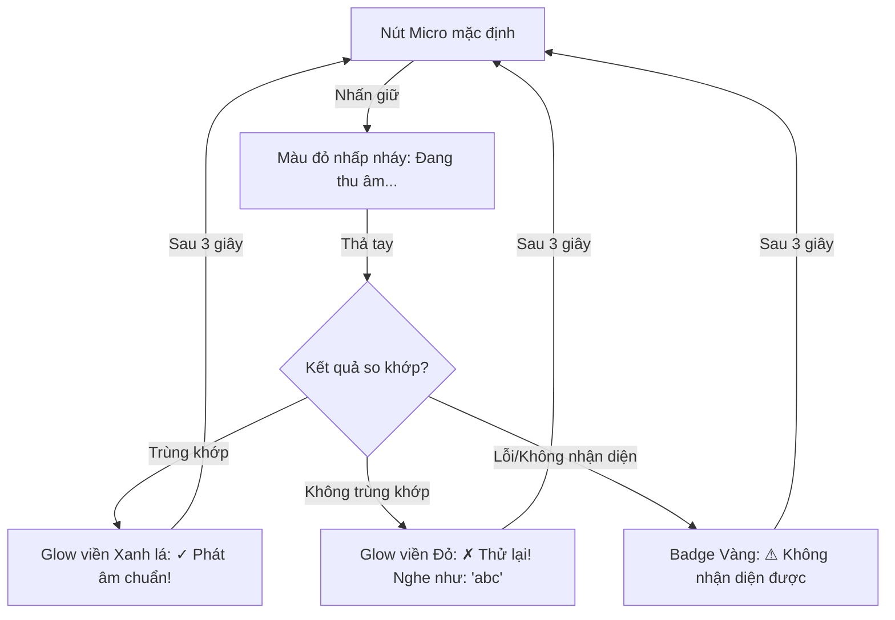

# Thiết Kế Tính Năng Kiểm Tra Phát Âm Người Dùng (Speech Recognition & Hold-to-Talk)

Tài liệu này đặc tả chi tiết thiết kế kỹ thuật và giải pháp triển khai tính năng **Kiểm tra phát âm của người dùng (User Pronunciation Checker)** trực tiếp trên giao diện LingoFlow. Tính năng này sử dụng **Web Speech API** tích hợp sẵn trong trình duyệt với tương tác nhấn giữ để nói (**Hold-to-Talk**).

---

## 1. Luồng Hoạt Động (Data Flow & Logic)

Khi người dùng thực hiện tương tác nhấn giữ nút Micro cạnh từ vựng:

1. **Kích hoạt ghi âm (Start)**:
   * Khi người dùng nhấn giữ (`onMouseDown` hoặc `onTouchStart`) trên nút Micro.
   * Hệ thống chuyển trạng thái nút sang màu đỏ nhấp nháy (`isRecording = true`).
   * Gọi bộ thu âm của trình duyệt thông qua **Web Speech API** (`SpeechRecognition`).
   * Hủy các bộ đọc/thu âm cũ đang chạy để tránh xung đột tài nguyên.

2. **Thu âm & Chuyển giọng nói thành văn bản (Speech-to-Text)**:
   * Trình duyệt thu nhận tín hiệu âm thanh từ micro của thiết bị.
   * Chuyển đổi trực tiếp tín hiệu giọng nói thành văn bản tiếng Anh (`en-US`).

3. **Kết thúc ghi âm (Stop)**:
   * Khi người dùng nhả chuột/tay ra khỏi nút (`onMouseUp`/`onMouseLeave` hoặc `onTouchEnd`/`onTouchCancel`).
   * Dừng tiến trình thu âm của trình duyệt.
   * Trả về kết quả văn bản nhận diện được (`transcript`) hoặc thông tin lỗi nếu có (chưa cấp quyền micro, không nghe thấy âm thanh...).

4. **So khớp & Chấm điểm (Matching & Evaluation)**:
   * Hệ thống chuẩn hóa cả từ gốc và từ nhận diện được bằng hàm chuẩn hóa chuỗi (chuyển chữ thường, xóa dấu câu, cắt khoảng trắng).
   * Tiến hành so khớp chính xác:
     * **Trùng khớp**: Đánh giá **ĐÚNG** (Success).
     * **Không trùng khớp**: Đánh giá **CHƯA ĐÚNG** (Failure), hiển thị từ mà trình duyệt nghe được để giúp người dùng tự sửa.
   * Hiển thị trạng thái phản hồi trực quan trên thẻ từ vựng trong **3 giây**, sau đó tự động biến mất để dọn dẹp giao diện.

---

## 2. Thiết Kế Giao Diện (UI/UX Design)

Nút Micro và các trạng thái hiển thị phản hồi sẽ được tích hợp vào các thẻ từ vựng trên hai giao diện chính: **Trang Quản Lý Từ Vựng (`Vocabulary.tsx`)** và **Trang Thẻ Học (`FlashcardsPage.tsx`)**.



### 2.1 Các Trạng Thái Giao Diện Của Nút Micro
* **Trạng thái bình thường**: Icon `Mic` màu xám nhạt, nằm cạnh icon loa phát âm. Thiết kế Glassmorphism đồng nhất với giao diện LingoFlow.
* **Trạng thái đang ghi âm**: Nút chuyển sang màu đỏ hồng (`bg-rose-500 text-white`), có hiệu ứng lan tỏa (`animate-ping`) và tooltip nhỏ *"Đang nghe..."*.
* **Trạng thái không hỗ trợ**: Nếu trình duyệt không hỗ trợ Web Speech API (hoặc HTTPS chưa được cấu hình), nút Micro sẽ chuyển sang trạng thái mờ (disabled) kèm tooltip *"Trình duyệt không hỗ trợ micro"*.

### 2.2 Hiệu Ứng Phản Hồi Trên Thẻ Từ Vựng
* **Khi phát âm ĐÚNG**:
  * Thẻ từ vựng hiển thị viền xanh lá mờ (`border-emerald-500/40 shadow-emerald-500/5`).
  * Một badge nhỏ xuất hiện cạnh từ vựng: `✓ Phát âm chuẩn` (`bg-emerald-50 text-emerald-600 dark:bg-emerald-950/30 dark:text-emerald-400`).
* **Khi phát âm CHƯA ĐÚNG**:
  * Thẻ từ vựng hiển thị viền đỏ mờ (`border-rose-500/40 shadow-rose-500/5`).
  * Một badge nhỏ xuất hiện: `✗ Thử lại` (`bg-rose-50 text-rose-600 dark:bg-rose-950/30 dark:text-rose-400`).
  * Hiển thị gợi ý nhỏ ngay phía dưới: *Nghe như: "[từ_nhận_diện_được]"*.

---

## 3. Kiến Trúc Mã Nguồn & Triển Khai Chi Tiết

Tính năng này được triển khai 100% ở phía **Frontend** bằng cách bổ sung một Custom Hook dùng chung và cập nhật các component thẻ từ vựng.

### 3.1 Custom Hook `useSpeechRecognition.ts`
Tạo file mới tại đường dẫn `frontend/src/hooks/useSpeechRecognition.ts` để bọc các hàm API của trình duyệt:

```typescript
import { useState, useEffect, useRef } from 'react';

export interface UseSpeechRecognitionReturn {
  isSupported: boolean;
  isRecording: boolean;
  transcript: string;
  error: string | null;
  startListening: () => void;
  stopListening: () => void;
  resetTranscript: () => void;
}

export const useSpeechRecognition = (lang: string = 'en-US'): UseSpeechRecognitionReturn => {
  const [isRecording, setIsRecording] = useState(false);
  const [transcript, setTranscript] = useState('');
  const [error, setError] = useState<string | null>(null);
  const [isSupported, setIsSupported] = useState(true);
  
  const recognitionRef = useRef<any>(null);

  useEffect(() => {
    const SpeechRecognition = (window as any).SpeechRecognition || (window as any).webkitSpeechRecognition;
    if (!SpeechRecognition) {
      setIsSupported(false);
    }
  }, []);

  const startListening = () => {
    const SpeechRecognition = (window as any).SpeechRecognition || (window as any).webkitSpeechRecognition;
    if (!SpeechRecognition) {
      setError('Trình duyệt không hỗ trợ thu âm');
      return;
    }

    try {
      // Dừng các tiến trình cũ nếu có
      if (recognitionRef.current) {
        recognitionRef.current.abort();
      }

      const recognition = new SpeechRecognition();
      recognition.continuous = false;
      recognition.interimResults = false;
      recognition.lang = lang;

      recognition.onstart = () => {
        setIsRecording(true);
        setTranscript('');
        setError(null);
      };

      recognition.onresult = (event: any) => {
        const result = event.results[0]?.[0]?.transcript;
        if (result) {
          setTranscript(result);
        }
      };

      recognition.onerror = (event: any) => {
        console.error('Lỗi nhận diện giọng nói:', event.error);
        setError(event.error === 'not-allowed' ? 'permission-denied' : event.error);
        setIsRecording(false);
      };

      recognition.onend = () => {
        setIsRecording(false);
      };

      recognitionRef.current = recognition;
      recognition.start();
    } catch (err: any) {
      setError(err.message || 'Không thể khởi động ghi âm');
      setIsRecording(false);
    }
  };

  const stopListening = () => {
    if (recognitionRef.current) {
      recognitionRef.current.stop();
    }
  };

  const resetTranscript = () => {
    setTranscript('');
    setError(null);
  };

  return {
    isSupported,
    isRecording,
    transcript,
    error,
    startListening,
    stopListening,
    resetTranscript
  };
};
```

### 3.2 Bộ chuẩn hóa chuỗi (`stringMatcher.ts`)
Tạo file mới tại `frontend/src/utils/stringMatcher.ts`:

```typescript
/**
 * Chuẩn hóa chuỗi bằng cách xóa bỏ khoảng trắng thừa, dấu câu và đưa về chữ thường.
 */
export const normalizeString = (str: string): string => {
  return str
    .toLowerCase()
    .trim()
    .replace(/[.,\/#!$%\^&\*;:{}=\-_`~()?]/g, "") // Xóa dấu câu
    .replace(/\s+/g, " "); // Xóa khoảng trắng thừa giữa các từ
};

/**
 * Kiểm tra xem từ phát âm nhận diện được có trùng khớp với từ gốc hay không.
 */
export const comparePronunciation = (original: string, recognized: string): boolean => {
  const normOriginal = normalizeString(original);
  const normRecognized = normalizeString(recognized);
  return normOriginal === normRecognized;
};
```

### 3.3 Cập nhật Giao Diện Thẻ Từ Vựng (`Vocabulary.tsx` và `FlashcardsPage.tsx`)
Tại mỗi component thẻ, ta sẽ quản lý trạng thái kiểm tra phát âm cục bộ của thẻ đó:

```typescript
// Trạng thái kiểm tra phát âm của từng thẻ từ
const [pronunciationResult, setPronunciationResult] = useState<'correct' | 'incorrect' | 'error' | null>(null);
const [heardText, setHeardText] = useState('');

// Sử dụng custom hook
const {
  isSupported,
  isRecording,
  transcript,
  error,
  startListening,
  stopListening,
  resetTranscript
} = useSpeechRecognition('en-US');

// Theo dõi transcript thay đổi để so khớp kết quả
useEffect(() => {
  if (transcript) {
    const isCorrect = comparePronunciation(item.word, transcript);
    setHeardText(transcript);
    setPronunciationResult(isCorrect ? 'correct' : 'incorrect');

    // Tự động xóa kết quả sau 3 giây
    const timer = setTimeout(() => {
      setPronunciationResult(null);
      resetTranscript();
    }, 3000);
    return () => clearTimeout(timer);
  }
}, [transcript]);

// Theo dõi lỗi micro
useEffect(() => {
  if (error) {
    setPronunciationResult('error');
    const timer = setTimeout(() => {
      setPronunciationResult(null);
      resetTranscript();
    }, 3000);
    return () => clearTimeout(timer);
  }
}, [error]);
```

Giao diện nút Micro sẽ hỗ trợ đầy đủ các sự kiện chuột và chạm:
```typescript
<button
  onMouseDown={startListening}
  onMouseUp={stopListening}
  onMouseLeave={stopListening}
  onTouchStart={(e) => { e.preventDefault(); startListening(); }}
  onTouchEnd={stopListening}
  onTouchCancel={stopListening}
  disabled={!isSupported}
  className={`p-1.5 rounded-full transition-all cursor-pointer ${
    isRecording
      ? 'bg-rose-500 text-white animate-pulse shadow-md shadow-rose-500/20'
      : 'bg-slate-100/80 dark:bg-slate-800/80 text-slate-500 hover:text-indigo-600 hover:bg-indigo-100 dark:hover:bg-indigo-900/50'
  }`}
  title="Nhấn giữ để nói và kiểm tra phát âm"
>
  <Mic className="w-4 h-4" />
</button>
```

---

## 4. Kế Hoạch Kiểm Thử (Testing Plan)
1. **Kiểm thử khả năng tương thích của trình duyệt**: Chạy thử trên Google Chrome, Microsoft Edge, Firefox, Safari (iOS & macOS) để xác định tính năng hoạt động ổn định.
2. **Kiểm thử quyền thiết bị**:
   * Kiểm tra hành vi khi chặn quyền truy cập micro (hệ thống phải báo lỗi `⚠ Chưa cấp quyền Micro` và không gây lỗi sập app).
   * Kiểm tra hành vi khi người dùng nói quá nhỏ hoặc không nói gì (sau khi nhả nút sẽ báo lỗi timeout hoặc không nhận dạng được).
3. **Kiểm thử so khớp từ**:
   * Phát âm đúng 100%: Hệ thống sáng xanh lá và hiển thị badge `✓ Phát âm chuẩn`.
   * Phát âm sai hoặc nhầm từ (ví dụ đọc "hello" cho từ "yellow"): Hệ thống sáng đỏ và hiển thị `Nghe như: "hello"`.
